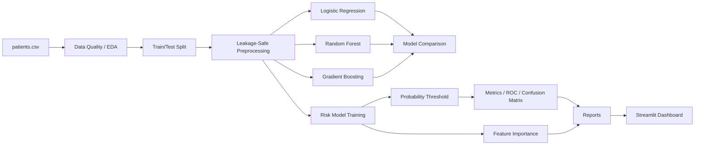

# Healthcare Risk Architecture

## Components

1. **Data layer** — `data/patients.csv` contains a deliberately small synthetic demonstration dataset with numeric, binary, and categorical predictors.
2. **EDA** — `src/eda.py` validates shape, missingness, target balance, numeric summaries, correlations, and risk distribution.
3. **Preprocessing** — `src/model.py` builds a scikit-learn `ColumnTransformer` and pipeline so transformations are fitted only on training data.
4. **Model comparison** — `src/model_comparison.py` evaluates Logistic Regression, Random Forest, and Gradient Boosting using the same train/test split.
5. **Evaluation** — `src/evaluate.py` trains on the training split and evaluates probabilities on the held-out split using a configurable classification threshold.
6. **Reporting** — evaluation writes machine-readable CSV/JSON outputs and EDA summaries/charts to `reports/`.
7. **Application** — `app.py` exposes a lightweight Streamlit dashboard for portfolio demonstration.
8. **CI** — `.github/workflows/ci.yml` runs compilation, tests, coverage, EDA, model comparison, and evaluation on pushes and pull requests.

## Important validation note

The dataset contains only 10 rows, so the current 100% holdout metrics are not statistically meaningful. The purpose of this repository is to demonstrate engineering workflow, reproducibility, testing, leakage-safe preprocessing, evaluation design, and communication—not clinical model validation.

A production extension should replace the demonstration dataset with a sufficiently large, representative, governed dataset and add temporal validation, subgroup/fairness analysis, calibration, monitoring, and clinical validation.
