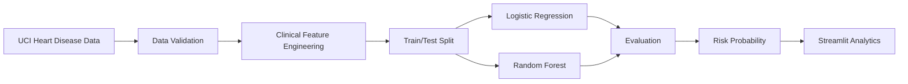

# Healthcare Risk Architecture

This is an educational analytics project and must not be presented as a clinical decision-support system. Model outputs require independent validation before any real-world healthcare use.
